# Oracle Movie Search - Documentatie tehnica

Acest proiect implementeaza trei stiluri de cautare pe un catalog de filme IMDB:

1. **Keyword Search** (lexical, bazat pe text)
2. **Semantic Search** (vectorial, bazat pe embedding-uri)
3. **Hybrid Search** (fuziune keyword + semantic)

Solutia foloseste Oracle Database (Oracle Text + Oracle AI Vector Search) si scripturi Python inserarea datelor, generare de embedding-uri si executia interogarilor.

---

## 1) Arhitectura solutiei

### 1.1 Componente

- **Sursa date**: `data/imdb_top_1000.csv`, https://www.kaggle.com/datasets/harshitshankhdhar/imdb-dataset-of-top-1000-movies-and-tv-shows?resource=download
- **Procesare date + embedding-uri**: `python/cleandataset.py`
- **Schema DB + indexuri**: `sql/scripts.sql`
- **Cautare keyword**: `python/keywordSearch.py`
- **Cautare semantica**: `python/semanticSearch.py`
- **Cautare hibrida**: `python/hybridSearch.py`
- **Configurare conexiune**: `.env`

### 1.2 Fluxul

1. Se creeaza schema Oracle si tabela `movies`
2. Se creeaza:
   - index Oracle Text pe coloana `search_text`
   - index vectorial IVF pe coloana `embedding`
3. Se creeaza o reprezentare textuala `search_text`
4. Se genereaza embedding-uri cu modelul `all-MiniLM-L6-v2`
5. Datele sunt inserate in tabelul `movies`
6. Scripturile de cautare executa interogarile keyword/semantic/hybrid

---

## 2) Modelul de date

### 2.1 Tabel principal

Modelul este definit in `sql/scripts.sql`:

```sql
CREATE TABLE movies (
    movie_id NUMBER PRIMARY KEY,
    title VARCHAR2(255),
    genre VARCHAR2(255),
    overview CLOB,
    search_text CLOB,
    embedding VECTOR(384)
);
```

### 2.2 Semnificatia campurilor

- `movie_id`: identificator unic al filmului
- `title`: titlul filmului
- `genre`: genurile filmului (text concatenat din dataset)
- `overview`: descriere narativa (text lung, CLOB)
- `search_text`: text unificat pentru cautare keyword (`Title + Genres + Overview`)
- `embedding`: reprezentare vectoriala (384 dimensiuni) pentru cautare semantica

## Schema bazei de date
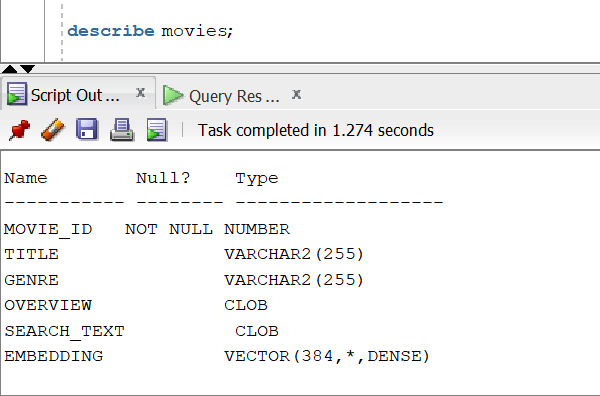


### 2.3 Indexuri

Indexurile sunt definite in `sql/scripts.sql`:


- **Index text**:
   Oracle transformă textul în tokenuri și construiește un inverted index. Structura generală a unui index CONTEXT este un inverted index: pentru fiecare token se păstrează lista de documente/rânduri în care apare.
  ```sql
  CREATE INDEX movies_text_idx
  ON movies(search_text)
  INDEXTYPE IS CTXSYS.CONTEXT;
  ```
- **Index vectorial (IVF)**:
  ```sql
  CREATE VECTOR INDEX movies_vec_ivf_idx
  ON movies(embedding)
  ORGANIZATION NEIGHBOR PARTITIONS
  DISTANCE COSINE
  WITH TARGET ACCURACY 90
  PARAMETERS (type IVF, NEIGHBOR PARTITIONS 8);
  ```

---

## 3) Inserare date si generare embedding-uri

Script: `python/cleandataset.py`

### 3.1 Transformari aplicate

- citire CSV din `data/imdb_top_1000.csv`
- selectie coloane relevante (`Series_Title`, `Genre`, `Overview`)
- eliminare valori lipsa
- adaugare `movie_id`
- construire `search_text`

```python
df["search_text"] = (
    "Title: " + df["title"] +
    ". Genres: " + df["genre"] +
    ". Overview: " + df["overview"]
)
```

### 3.2 Embedding-uri

Embedding-urile se genereaza cu `SentenceTransformer("all-MiniLM-L6-v2")`:

```python
model = SentenceTransformer("all-MiniLM-L6-v2")
df["embedding"] = df["search_text"].apply(lambda x: model.encode(x))
```

Inserarea in Oracle foloseste tipul vectorial, trimis ca reprezentare text `[...]`.


## Tabela din baza de date
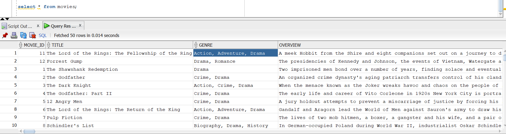
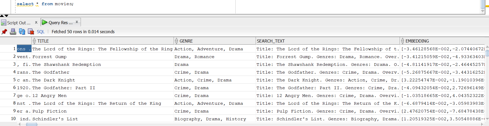

---

## 4) Keyword Search (cautare clasica)

Script: `python/keywordSearch.py`

Interogarea foloseste Oracle Text:

```sql
SELECT movie_id,
       title,
       overview,
       SCORE(1) AS keyword_score  # term frequency + inverse document frequency (TF-IDF)
                                  # scor de relevanta calculat de Oracle Text pe baza frecventei
                                  # termenilor în document si a raritatii lor in colecția de documente.
FROM movies
WHERE CONTAINS(search_text, :query_text, 1) > 0
ORDER BY keyword_score DESC
FETCH FIRST 10 ROWS ONLY
```

`SCORE(1)` este calculat de Oracle Text pentru relevanta lexicala.

## Output keyword search

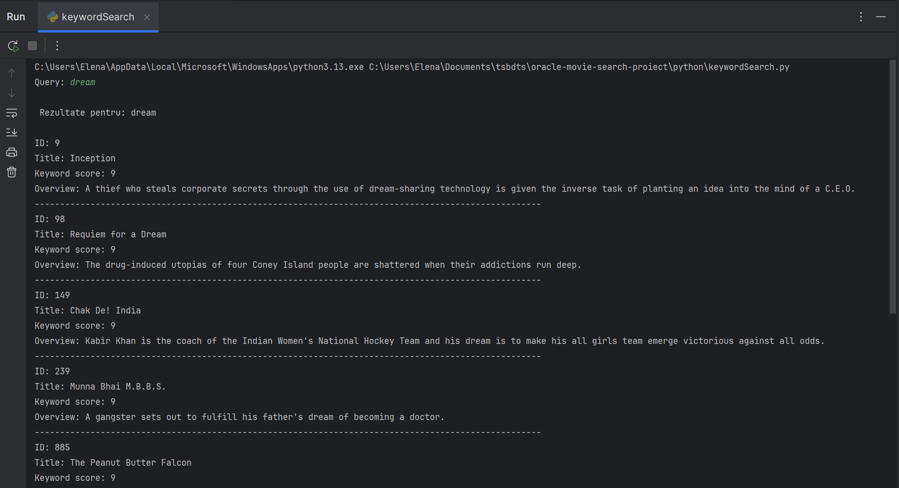
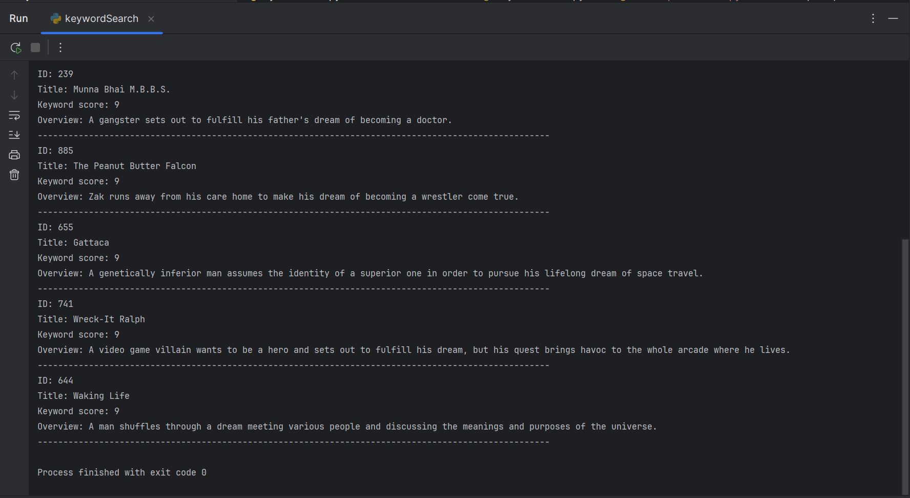


---

## 5) Semantic Search (vector search)

Script: `python/semanticSearch.py`

### 5.1 Pasii tehnici

1. Query-ul utilizatorului este transformat in embedding
2. Se calculeaza distanta cosine intre `embedding` si vectorul primit ca parametru
3. Rezultatele sunt ordonate dupa distanta minima

### 5.2 Variante abordate

- **Exact search**:
  ```sql
  ORDER BY VECTOR_DISTANCE(embedding, :query_vector, COSINE)
  FETCH FIRST 10 ROWS ONLY
  ```
- **Approximate search**:
  ```sql
  ORDER BY VECTOR_DISTANCE(embedding, :query_vector, COSINE)
  FETCH APPROX FIRST 10 ROWS ONLY WITH TARGET ACCURACY 80
  ```
Folosim `80` ca valoare la `TARGET ACCURACY` deoarece este valoarea de echilibru intre o cautare rapida si una relevanta.

## Output semantic search

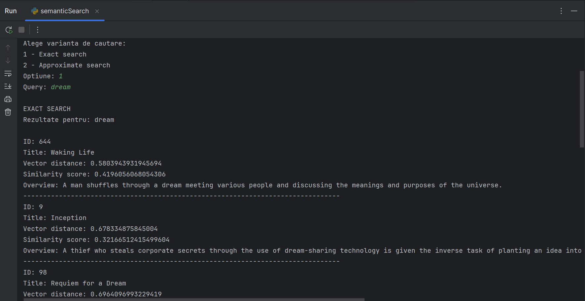
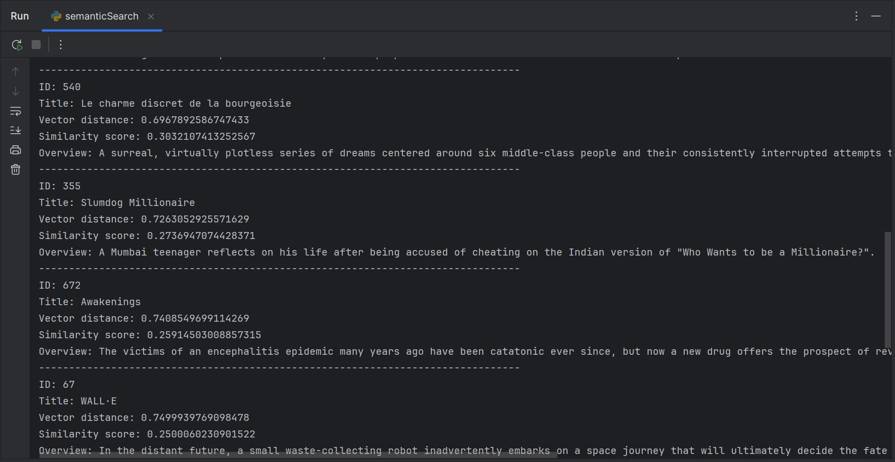
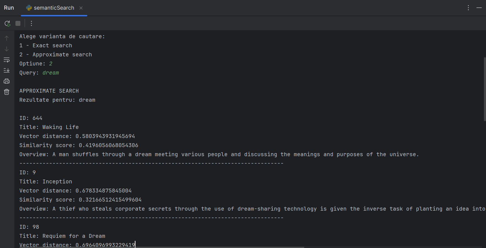
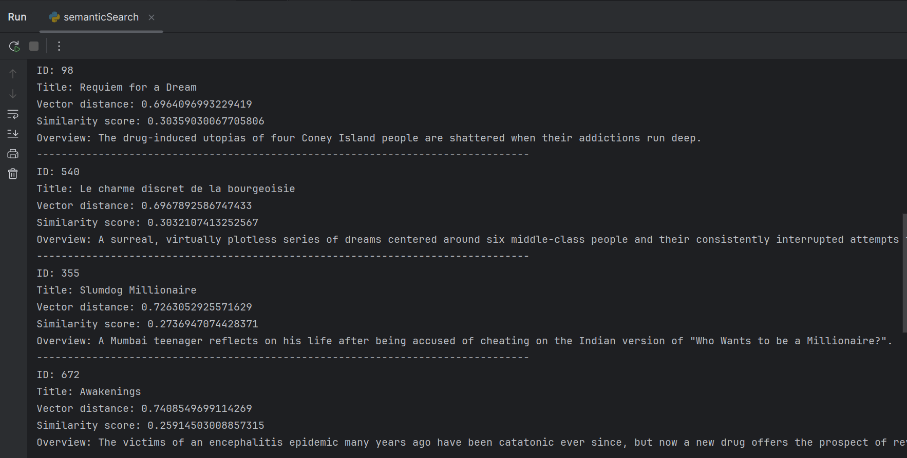


---

## 6) Hybrid Search (keyword + semantic)

Script: `python/hybridSearch.py`

Implementarea creeaza doua seturi candidate:

- `kw`: candidate keyword cu `kw_score` si `kw_rank`;
- `vec`: candidate semantice cu `vec_distance` si `vec_rank`,

unde:

- `kw_score` = scor lexical Oracle Text (mai mare = mai relevant textual)
- `kw_rank` = poziția în clasamentul keyword (1 = cel mai bun keyword match)
- `vec_distance` = distanța semantică (mai mic = mai apropiat ca sens)
- `vec_rank` = poziția semantică (1 = cel mai apropiat semantic)

Seturile sunt combinate prin `FULL OUTER JOIN`, iar scorul final se calculeaza pe baza `Reciprocal Rank Fusion`.

`RRF` este o metoda standard de a combina mai multe ranking-uri fara a compara direct scorurile brute, deoarece au naturi diferite.

```sql
NVL(:text_weight / (:rank_penalty + kw.kw_rank), 0) +
NVL(:vector_weight / (:rank_penalty + vec.vec_rank), 0) AS hybrid_score
```

Parametri in cod:

- `text_weight = 1.0` - ponderea cautarii lexicale
- `vector_weight = 2.0` - valoare mai mare deoarece cautarea vectoriala este mai relevanta
- `rank_penalty = 60` - folosita pentru stabilitate, prioritizeaza valorile de top dar le ia in considerare si pe celelalte
- `top_k = 5` - numarul de elemente in selectia finala
- `candidate_k = 20` - numarul de candidati selectati din fiecare lista

## Output hybrid search

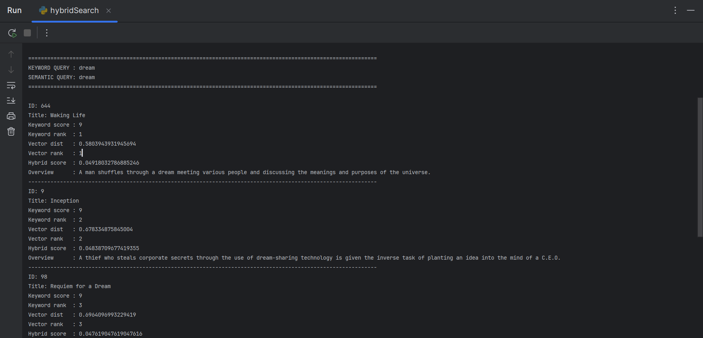
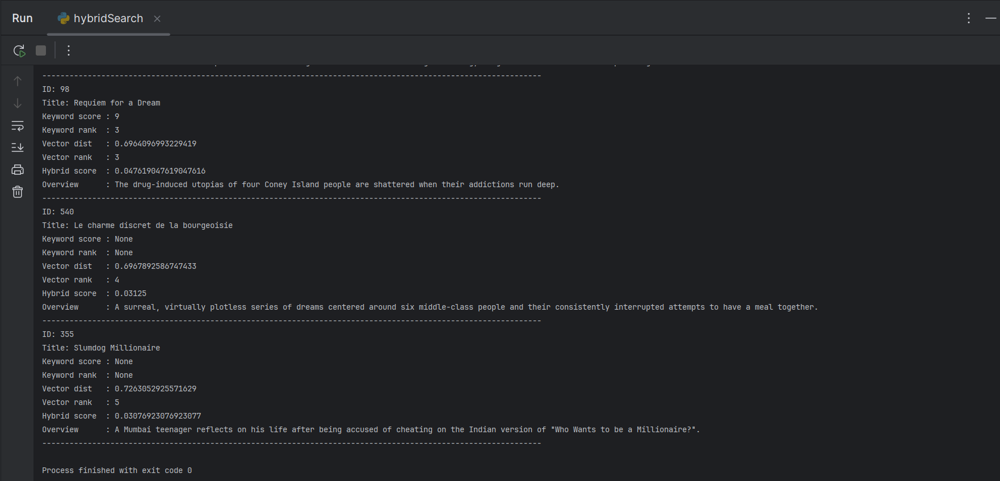

---

## 7) Configurare si rulare

### 7.1 Variabile de mediu

Fisierul `.env` trebuie sa contina:

- `DB_USER`
- `DB_PASSWORD`
- `DB_HOST`
- `DB_PORT`
- `DB_SERVICE`

### 7.2 Ordine recomandata de executie

1. Scripturile din `sql/scripts.sql` trebuie rulate direct in mediul de baze de date
2. Urmeaza inserarea datelor: `python/cleandataset.py`
3. Scripturile de cautare:
   - `python/keywordSearch.py`
   - `python/semanticSearch.py`
   - `python/hybridSearch.py`

---

## 8) Versiuni ale tool-urilor utilizate

- `Python`: `3.10.0`
- `oracledb`: `3.4.2`
- `python-dotenv`: `1.2.2`
- `sentence-transformers`: `5.3.0`
- `pandas`: `3.0.1`
- `Oracle`: `Oracle AI Database 26ai`

---
